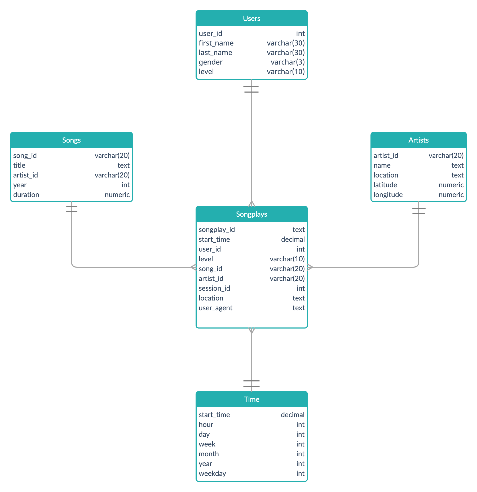

# Data Warehouse with AWS Redshift
## Table of Contents
* [About the Project](#about-the-project)
* [Usage](#usage)
* [Project Structure](#project-structure)
* [Database Design and ETL Pipeline](#database-design-and-etl-pipeline)

  * [Schema](#schema)

<a name="about-the-project"/>

## About the Project
This project deals with data modeling with postgres for a music streaming app by 'Sparkify'. Sparkify has collected data of songs and user activity from their app in the form of JSON files and wants to analyze what songs users are listening to.

This project creates an ETL pipeline for this purpose and stores data in the postgres database using a star schema. In this schema we create fact and dimension tables; fact table having our quantitative business information (songs users are listening to) and dimension tables having descriptive attributes (song and user details etc.) related to fact table.

<a name="usage"/>

## Usage
`etl.py` is the main python file for this project which creates ETL pipeline. Before running this file make sure to run `create_tables.py` in your current workspace.
```bash
/home/workspace# python3 create_tables.py
/home/workspace# python3 etl.py
```

There is also a python notebook for creating and deleting Redshift and AWS resources. You need to run all cells containing python functions.

To create redshift resources:
`iam_client, redshift_client, ec2_client = create_aws_resources()`

To open public access to database:
`open_access_to_cluster(ec2_client, redshift_client)`

To delete resources:
`delete_aws_resources(iam_client, redshift_client)`

To see cluster status: 
`redshift_cluster_status(redshift_client, verbose=True)`

<a name="project-structure"/>

## Project Structure
This repository includes a data folder which contains song_data and log_data. In addition to data folder project contains 5 files:

1. `create_tables.py`: This file drops and creates your tables and you need to reset your tables before each time you run your ETL scripts.
2. `redshift.ipynb`: This notebook contains code to show, create and delete redshift resources.
3. `etl.py`: This file creates the ETL pipeline, reads and processes files from song_data and log_data and loads them into staging tables and then loads them into facts and dimension tables.
4. `sql_queries.py`: This file contains all sql queries used in `create_tables.py` and `etl.py` files.
5. `dwh.cfg`: This file contains configurations of redshift database and IAM role.

<a name="database-design-and-etl-pipeline"/>

## Database Design and ETL Pipeline

This project defines fact and dimension tables for a star schema for user-songplay analytic focus, and writes an ETL pipeline that transfers data from s3 storage to staging tables in redshift database and then transfers data into fact and dimensions tables after transformation.

<a name="schema"/>

### Schema


In above schema, we have a fact table containing quantitative information and our analytic focus; songs users are listening to. Moreover, we have four dimension tables: users, artists, songs and time which contains descriptive attributes related to fact table.

In `etl.py` we have two processing functions: `load_staging_tables` which extract the data from the song and log json files in s3 storage and then loads this data into staging tables and `insert_tables` which transforms the inputs from staging tables and loads the data into the facts and dimension tables.